# Development Guide

This document provides a high-level overview of the architecture and logic of the `voice-satellite-card`.

## Architecture Overview

The Voice Satellite Card is a **Home Assistant Custom Card** (Web Component) that runs entirely in the browser. It combines local wake word detection with Home Assistant's cloud/local Assist Pipeline.

### Components

1.  **VoiceSatelliteCard (Web Component)**: The main entry point. Handles UI, configuration, and orchestration.
2.  **AudioWorklet**: A separate thread that processes raw audio from the microphone. It buffers audio into chunks.
3.  **ONNX Runtime Web (WASM)**: Runs the machine learning models in the browser.
4.  **Home Assistant Connection**: A WebSocket connection to Home Assistant to stream audio and receive events.
5.  **Chat UI**: A conditional interface for text-based interactions (`mode: text` or `mode: both`).


## Data Flow

1.  **Microphone**: Captures audio at 16kHz.
2.  **AudioWorklet**: Buffers audio into 1280-sample chunks (80ms).
3.  **VAD (Voice Activity Detection)**: The main thread runs `silero_vad` to check if speech is present.
4.  **Wake Word Inference**:
    -   If speech is detected, the audio chunk is passed to the **Mel Spectrogram** model.
    -   The output is buffered and passed to the **Embedding** model.
    -   The embeddings are passed to the **Wake Word Classifier** (e.g., `ok_nabu`).
5.  **Assist Pipeline**:
    -   If the wake word is detected, the card switches to `assist_active` state.
    -   It opens a pipeline session with Home Assistant (`assist_pipeline/run`).
    -   Raw audio is streamed to HA via WebSocket.
    -   HA responds with events (`stt-start`, `stt-end`, `tts-start`, `tts-end`).
6.  **Feedback**: The card plays audio (TTS) and updates the UI based on HA events.

## State Machine

The card operates in a simple state machine:

-   **`idle`**: Not listening.
-   **`listening_ww`**: Listening for the wake word (Local processing).
-   **`assist_active`**: Streaming audio to Home Assistant (Server processing).

## Models

The card uses three ONNX models:
1.  **`silero_vad.onnx`**: Detects human speech to save resources.
2.  **`melspectrogram.onnx`**: Converts raw audio to Mel Spectrograms.
3.  **`embedding_model.onnx`**: Converts spectrograms to embeddings.
4.  **`ok_nabu.onnx`** (or others): Classifies the embeddings to detect the specific wake word.

## Configuration

The card is configured via YAML in the Dashboard:

```yaml
type: custom:voice-satellite-card
wake_word: ok_nabu
pipeline: <pipeline_id>
```

-   `wake_word`: Selects the model file to load.
-   `pipeline`: Passed to `assist_pipeline/run` to select the assistant.
-   `mode`: Controls the active components (`voice`, `text`, `both`).

## Modes

-   **Voice**: Default. Loads VAD/Wake Word models. Standard satellite behavior.
-   **Text**: Disables microphone processing and model loading. Only shows Chat UI.
-   **Both**: Loads all models for voice, but also renders Chat UI for hybrid usage.

```mermaid
flowchart TD
    A[Card caricata] --> B{"Premuto\nStart Listening?"}
    B -->|No| A
    B -->|Sì| C[Richiesta microfono]
    C --> D[AudioContext 16kHz + AudioWorklet]
    D --> E[Loop chunk 1280 campioni]

    subgraph WakeWord [Rilevamento Wake Word]
        direction TB
        E --> F[Esegui Silero VAD ONNX]
        F --> G{Voce attiva?}
        G -->|No| E
        G -->|Sì| H[Mel-spectrogramma .onnx]
        H --> I[Normalizza e bufferizza]
        I --> J{mel_buffer ≥ 76?}
        J -->|No| E
        J -->|Sì| K[Embedding 96-dim]
        K --> L[Buffer ultimi 16 embedding]
        L --> M[Tensori 1,16,96]
        M --> N[Modello wake word .onnx]
        N --> O{Score > 0.5?}
        O -->|No| E
        O -->|Sì| P[WAKE WORD RILEVATA]
    end

    P --> Q[Beep conferma]
    Q --> R[UI: Speaking to HA]
    R --> S[Apri assist_pipeline/run]
    S --> T[Streaming PCM 16-bit → HA]

    subgraph HA [Home Assistant Pipeline]
        direction TB
        T --> X[STT → testo]
        X --> Y[Intent recognition]
        Y --> Z[TTS → audio]
        Z --> W[Invio URL TTS]
    end

    W --> PLAY[Play TTS nel browser]
    PLAY --> END{Audio finito?}
    END -->|Sì| BEEP[Beep fine]
    BEEP --> BACK[Torna in ascolto]
    BACK --> E

    style P fill:#4CAF50,color:white,font-weight:bold
    style Q fill:#2196F3,color:gry
    style R fill:#FFEB3B,color:black
    style BEEP fill:#FF9800,color:grey
    style WakeWord fill:#000330,stroke:#1976D2,stroke-width:2px
    style HA fill:#005500,stroke:#7B1FA2,stroke-width:3px
```


