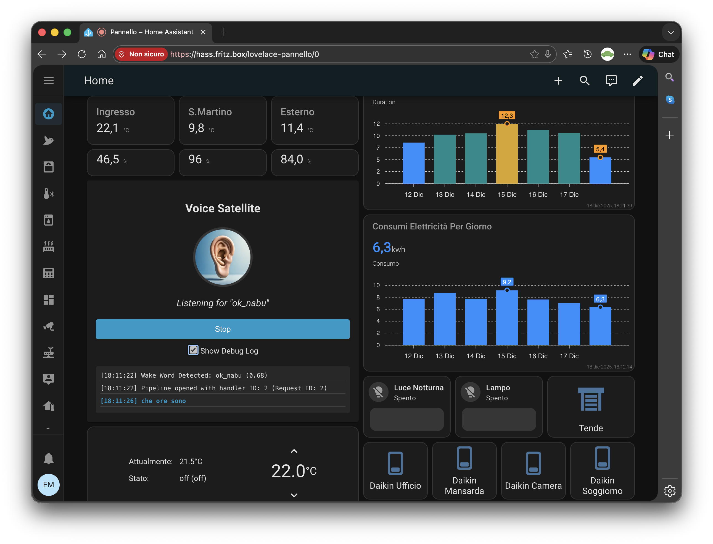

# Voice Satellite Custom Card

A Home Assistant custom card that turns your browser into a fully-featured
voice satellite using **openWakeWord** running locally in the browser
(via ONNX Runtime Web/WASM). It integrates directly with Home Assistant's
Assist Pipeline for local wake word detection and maximum privacy.

 

## Features
- **Local Wake Word**: Runs entirely in the browser — no audio sent until
  wake word is detected.
- **Native Integration**: Direct audio streaming to Assist Pipeline.
- **Maximum Privacy**: All wake word processing on-device.
- **No Extra Server**: No Python/Wyoming needed for detection.
- **Rich Feedback**: Colored indicators, beeps, icons, debug log.
- **Chat Interface**: Optional text-based interaction mode.
- **Minimal Layouts**: Support for Floating Action Button (FAB) mode.


 

## Credits & Inspiration
- Built on **openWakeWord** by [dscripka/openWakeWord](https://github.com/dscripka/openWakeWord)
  (MIT License).
- Inspired by "Open Wake Word on the Web" from Deep Core Labs
  (https://deepcorelabs.com/open-wake-word-on-the-web/).
- Uses Microsoft's ONNX Runtime Web.

**AI Assistance Disclaimer**: Parts of this code were generated or assisted
by AI models (including Grok by xAI). All code has been manually reviewed
and tested.

## Installation

#### 1. Create Directory
Create folder: `config/www/voice-satellite-card/`

#### 2. Copy Files
Copy all files from this repository into the created folder.
Structure should look like:
- `config/www/voice-satellite-card/voice-satellite-card.js`
- `config/www/voice-satellite-card/assets/...`
- `config/www/voice-satellite-card/models/...`
- `config/www/voice-satellite-card/ort-wasm...`

#### 3. Add Resource
Settings → Dashboards → Resources → Add Resource
- URL: `/local/voice-satellite-card/voice-satellite-card.js`
- Type: `JavaScript Module`

### 4. Add Card to Dashboard
```yaml
type: custom:voice-satellite-card
wake_word: ok_nabu
pipeline: my_voice_pipeline  # optional
mode: both # 'voice' (default), 'text', or 'both'
style: fab # 'card' (default) or 'fab'


```

### Configuration Options

| Option | Description | Default |
| :--- | :--- | :--- |
| `wake_word` | The wake word model to use. Options: `ok_nabu`, `alexa`, `hey_jarvis`, `hey_rhasspy`. | `ok_nabu` |
| `pipeline` | The ID of the Home Assistant Assist Pipeline to use. If omitted, uses the default pipeline. | Default Pipeline |
| `mode` | Operation mode: `voice` (classic), `text` (chat only), `both` (hybrid). | `voice` |
| `style` | Layout style: `card` (full card) or `fab` (floating button). | `card` |


## Usage
1.  Click **Start Listening**.
2.  Grant microphone permissions.
3.  Say "Alexa" (or your configured wake word).
4.  Speak your command to Home Assistant.

## Troubleshooting
-   **Microphone Error**: Ensure you are accessing Home Assistant via HTTPS or localhost. Browsers block microphone access on insecure HTTP (except localhost). Or test on HTTP without SSL go to chrome://flags/#unsafely-treat-insecure-origin-as-secure, enable it, and add your server’s URL (e.g., http://192.168.1.100:8123) 
-   **Models not loading**: Check the browser console (F12) for 404 errors. Ensure the `models` folder is correctly placed in `www/voice-satellite-card/`.
-   **Connection Error**: Ensure your Home Assistant URL is correct. The card uses the authenticated session from the dashboard.

## License
MIT License — see LICENSE file.
