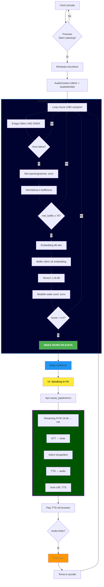

```mermaid
flowchart TD
    A[Card caricata] --> B{"Premuto\nStart Listening?"}
    B -->|No| A
    B -->|Sì| C[Richiesta microfono]
    C --> D[AudioContext 16kHz + AudioWorklet]
    D --> E[Loop chunk 1280 campioni]

    subgraph WakeWord [Rilevamento Wake Word]
        direction TB
        E --> F[Esegui Silero VAD ONNX]
        F --> G{Voce attiva?}
        G -->|No| E
        G -->|Sì| H[Mel-spectrogramma .onnx]
        H --> I[Normalizza e bufferizza]
        I --> J{mel_buffer ≥ 76?}
        J -->|No| E
        J -->|Sì| K[Embedding 96-dim]
        K --> L[Buffer ultimi 16 embedding]
        L --> M[Tensori 1,16,96]
        M --> N[Modello wake word .onnx]
        N --> O{Score > 0.5?}
        O -->|No| E
        O -->|Sì| P[WAKE WORD RILEVATA]
    end

    P --> Q[Beep conferma]
    Q --> R[UI: Speaking to HA]
    R --> S[Apri assist_pipeline/run]
    S --> T[Streaming PCM 16-bit → HA]

    subgraph HA [Home Assistant Pipeline]
        direction TB
        T --> X[STT → testo]
        X --> Y[Intent recognition]
        Y --> Z[TTS → audio]
        Z --> W[Invio URL TTS]
    end

    W --> PLAY[Play TTS nel browser]
    PLAY --> END{Audio finito?}
    END -->|Sì| BEEP[Beep fine]
    BEEP --> BACK[Torna in ascolto]
    BACK --> E

    style P fill:#4CAF50,color:white,font-weight:bold
    style Q fill:#2196F3,color:gry
    style R fill:#FFEB3B,color:black
    style BEEP fill:#FF9800,color:grey
    style WakeWord fill:#000330,stroke:#1976D2,stroke-width:2px
    style HA fill:#005500,stroke:#7B1FA2,stroke-width:3px
```