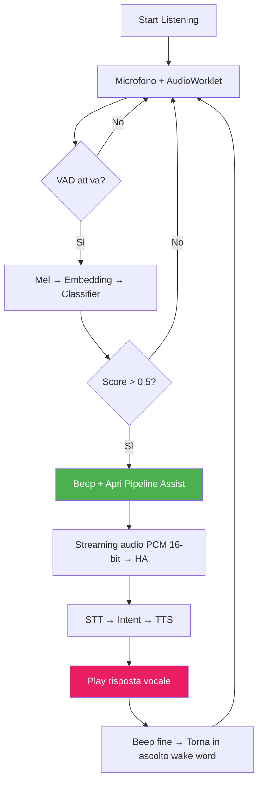

```mermaid
flowchart TD
    A[Start Listening] --> B[Microfono + AudioWorklet]
    B --> C{VAD attiva?}
    C -->|No| B
    C -->|Sì| D[Mel → Embedding → Classifier]
    D --> E{Score > 0.5?}
    E -->|No| B
    E -->|Sì| F[Beep + Apri Pipeline Assist]
    F --> G[Streaming audio PCM 16-bit → HA]
    G --> H[STT → Intent → TTS]
    H --> I[Play risposta vocale]
    I --> J[Beep fine → Torna in ascolto wake word]
    J --> B

    style F fill:#4CAF50,color:white
    style I fill:#E91E63,color:white
```